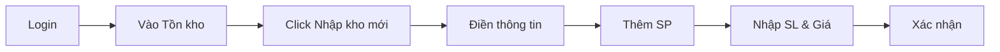

# 🧪 Hướng Dẫn Test Ứng Dụng KHO AI

1. Connect the frontend Dashboard to fetch real data


> Phiên bản: 1.0.0 | Cập nhật: July 2026

---

## 📋 Mục Lục

1. [Yêu Cầu Hệ Thống](#1-yêu-cầu-hệ-thống)
2. [Cài Đặt & Khởi Chạy](#2-cài-đặt--khởi-chạy)
3. [Tài Khoản Test](#3-tài-khoản-test)
4. [Danh Sách Màn Hình](#4-danh-sách-màn-hình)
5. [Test Theo Luồng Nghiệp Vụ](#5-test-theo-luồng-nghiệp-vụ)
6. [Test Responsive](#6-test-responsive)
7. [Test Dark Mode](#7-test-dark-mode)
8. [Test Database](#8-test-database)
9. [Checklist Kiểm Tra](#9-checklist-kiểm-tra)
10. [Khắc Phục Sự Cố](#10-khắc-phục-sự-cố)

---

## 1. Yêu Cầu Hệ Thống

### Phần mềm bắt buộc

| Phần mềm | Phiên bản tối thiểu | Tải về |
|----------|---------------------|--------|
| Node.js | >= 16.x | https://nodejs.org/ |
| PostgreSQL | >= 14.x | https://www.postgresql.org/download/ |
| Git | >= 2.x | https://git-scm.com/ |
| Trình duyệt | Chrome/Firefox/Edge mới nhất | - |

### Ports cần mở

| Port | Dịch vụ | Mục đích |
|------|---------|----------|
| 5173 | Vite Dev Server | Frontend (React) |
| 3001 | Express API | Backend |
| 5432 | PostgreSQL | Database |
| 5555 | Prisma Studio | GUI Database |

---

## 2. Cài Đặt & Khởi Chạy

### Bước 1: Clone & Cài đặt Frontend

```bash
# Mở Terminal tại thư mục gốc
cd f:\lap trinh\Q_L_K

# Cài đặt dependencies
npm install

# Khởi chạy frontend dev server
npm run dev
```
✅ **Mở:** http://localhost:5173

---

### Bước 2: Cài đặt Backend

```bash
# Di chuyển vào thư mục backend
cd backend

# Cài đặt dependencies (nếu chưa)
npm install

# Kiểm tra database đã được tạo chưa
npx prisma db push --accept-data-loss

# Seed dữ liệu mẫu (nếu chưa)
node src/seed.js

# Khởi chạy backend API
npm run dev
```
✅ **Mở:** http://localhost:3001

---

### Bước 3: Xem Database (Optional)

```bash
cd backend
npx prisma studio
```
✅ **Mở:** http://localhost:5555

---

## 3. Tài Khoản Test

| Vai trò | Email | Mật khẩu | Mô tả quyền |
|---------|-------|-----------|-------------|
| 🛡️ **Admin** | admin@khoai.com | 123456 | Toàn quyền: CRUD SP, NV, NCC, Xem báo cáo, Cài đặt hệ thống |
| 📊 **Manager** | manager@khoai.com | 123456 | Quản lý kho, Nhập/Xuất, Báo cáo, Quản lý vị trí |
| 👷 **Staff** | staff@khoai.com | 123456 | Nhập kho, Xuất kho, Quản lý tồn kho |
| 📋 **Storekeeper** | storekeeper@khoai.com | 123456 | + Xem báo cáo, Quản lý tồn kho |

---

## 4. Danh Sách Màn Hình

### 4.1. Auth Pages (Không cần đăng nhập)

| # | Route | Chức năng | Test |
|---|-------|-----------|------|
| 1 | `/login` | Đăng nhập bằng Email/SĐT | ✅ |
| 2 | `/forgot-password` | Quên mật khẩu (OTP 2 bước) | ✅ |

### 4.2. Dashboard Pages (Cần đăng nhập)

| # | Route | Chức năng | File source |
|---|-------|-----------|-------------|
| 3 | `/` | **Dashboard** - KPI, Line Chart, Top SP, Tables | `Dashboard.jsx` |
| 4 | `/products` | **Sản phẩm** - Danh sách, Filter, CRUD | `Products.jsx` |
| 5 | `/products/:code` | **Chi tiết SP** - 4 tabs (Info, Tồn kho, Lịch sử, Tài liệu) | `ProductDetail.jsx` |
| 6 | `/inventory` | **Tồn kho** - Multi-select, Filter, Mobile cards | `InventoryManagement.jsx` |
| 7 | `/inventory/create` | **Nhập kho** - Form, Dynamic table, Summary | `CreateStockIn.jsx` |
| 8 | `/inventory/out/create` | **Xuất kho** - Barcode scan, Validation | `CreateStockOut.jsx` |
| 9 | `/inventory/check` | **Kiểm kê** - Quick/Full mode, Diff calc | `InventoryCheck.jsx` |
| 10 | `/bin-location` | **Vị trí lưu trữ** - Tree view, 2D/3D Grid, Drag & Drop | `BinLocation.jsx` |
| 11 | `/orders` | **Đơn hàng** - Status filter, 5 trạng thái | `Orders.jsx` |
| 12 | `/orders/:id` | **Chi tiết đơn** - Timeline, Actions | `OrderDetail.jsx` |
| 13 | `/suppliers` | **Nhà cung cấp** - 9 cột, Search | `Suppliers.jsx` |
| 14 | `/employees` | **Nhân viên** - 8 permissions, Phân quyền modal | `Employees.jsx` |
| 15 | `/reports` | **Báo cáo** - 6 loại: Pie, Line, Bar, Tables | `Reports.jsx` |
| 16 | `/profile` | **Cá nhân** - 4 tabs: Info, Password, Notif, Devices | `Profile.jsx` |
| 17 | `/settings` | **Hệ thống** - 7 menu: Company, WH, Integrations... | `Settings.jsx` |
| 18 | `/notifications` | **Thông báo** - 5 loại, Unread filter, Real-time | `Notifications.jsx` |

---

## 5. Test Theo Luồng Nghiệp Vụ

### 🅰️ Luồng Nhập Kho

**Mục tiêu:** Kiểm tra quy trình nhập hàng từ NCC vào kho



**Các bước test:**
```
1. Login với admin@khoai.com / 123456
2. Vào /inventory
3. Click nút "Nhập kho mới" (màu xanh dương)
4. Kiểm tra:
   □ Hiển thị số phiếu: NK-YYYYMMDD-XXX
   □ Form: Ngày nhập, NCC, Kho nhận, Người nhập
   □ Textarea ghi chú
5. Click "Thêm dòng" → Thêm 3 dòng sản phẩm
6. Nhập: SP001 (10 cái, 22,000,000đ), SP008 (20 cái, 5,500,000đ)
7. Kiểm tra:
   □ Thành tiền tự động tính
   □ Tổng số lượng = 30
   □ Tổng tiền = 330,000,000đ
8. Click "Xác nhận nhập kho"
9. □ Alert thành công
```

**Expected:** ✅ Alert "Đã xác nhận nhập kho thành công"

---

### 🅱️ Luồng Xuất Kho

**Mục tiêu:** Kiểm tra quy trình xuất hàng

**Các bước test:**
```
1. Login
2. Vào /inventory
3. Click nút "Xuất kho mới" (màu xanh lá)
4. Kiểm tra:
   □ Sidebar form: Kho, Đơn hàng, Lý do, Người nhận
   □ Barcode scan button
   □ Empty state "Chưa có sản phẩm nào"
5. Click "Thêm sản phẩm" → Search dropdown
6. Tìm "iPhone" → Chọn SP001
7. Nhập số lượng xuất = 2
8. Kiểm tra:
   □ Thành tiền tự động tính
   □ Validation: không vượt quá tồn kho
9. Click "Xác nhận xuất kho"
```

**Expected:** ✅ Alert "Đã xác nhận xuất kho thành công"

---

### 🅲 Luồng Kiểm Kê

**Mục tiêu:** Kiểm tra quy trình kiểm đếm thực tế

**Các bước test:**
```
1. Login
2. Vào /inventory
3. Click "Kiểm kê ngay" (màu cam)
4. Kiểm tra:
   □ Filter: Kho, Ngày, Chế độ (Nhanh/Toàn bộ)
5. Chọn chế độ "Kiểm kê toàn bộ"
6. Click "Thêm sản phẩm" → Thêm SP001, SP003
7. Nhập tồn thực tế:
   □ SP001: nhập 43 (hệ thống: 45)
   □ SP003: nhập 15 (hệ thống: 15)
8. Kiểm tra:
   □ Chênh lệch SP001 = -2 (màu đỏ)
   □ Chênh lệch SP003 = 0 (màu xám)
   □ Summary: Tổng tồn, Thực tế, Chênh lệch
9. Click "Hoàn tất & Tạo biên bản"
```

**Expected:** ✅ Alert "Đã hoàn tất kiểm kê và tạo biên bản"

---

### 🅳 Luồng Đơn Hàng

**Mục tiêu:** Kiểm tra quản lý đơn hàng

**Các bước test:**
```
1. Login
2. Vào /orders
3. Kiểm tra:
   □ 5 filter: Trạng thái, Kho, Thời gian, Search
   □ 5 màu status: Vàng, Xanh dương, Tím, Xanh lá, Đỏ
4. Click mắt (Eye) ở đơn DH20241114001
5. Kiểm tra OrderDetail:
   □ Customer info: Tên, SĐT, Địa chỉ
   □ Order info: Ngày tạo, Dự kiến giao, Thanh toán
   □ Kho xuất: Kho Hà Nội
   □ Table sản phẩm: Mã, Tên, SL, Đơn giá, Thành tiền
   □ Timeline: 4 bước (dòng kết nối dọc)
   □ Buttons: "Xác nhận đơn", "Hủy đơn", "In hóa đơn"
6. Click "Xác nhận đơn" → Alert
```

**Expected:** ✅ Alert "Đã xác nhận đơn hàng thành công"

---

### 🅴 Luồng Phân Quyền

**Mục tiêu:** Kiểm tra phân quyền 8 permissions

**Các bước test:**
```
1. Login với admin
2. Vào /employees
3. Click Shield icon ở row đầu (Nguyễn Văn A)
4. Kiểm tra Modal:
   □ Title: "Phân quyền - Nguyễn Văn A"
   □ 8 checkboxes permissions
   □ Mỗi permission có description
5. Toggle 1 checkbox → Uncheck
6. Click "Lưu phân quyền" → Alert
7. Click "Hủy" → Đóng modal
```

**Expected:** ✅ Modal mở/đóng mượt, Checkbox toggle, Alert lưu thành công

---

### 🅵 Luồng Báo Cáo

**Mục tiêu:** Kiểm tra 6 loại báo cáo

**Các bước test:**
```
1. Login
2. Vào /reports
3. Test từng loại báo cáo:

   a) Tồn kho tổng hợp:
      □ Pie Chart với 4 màu (Xanh dương, Xanh lá, Cam, Xám)
      □ Label % trên biểu đồ
      □ Table chi tiết bên dưới
   
   b) Nhập - Xuất:
      □ Line Chart 2 đường (Xanh lá: Nhập, Đỏ: Xuất)
      □ Hover tooltip hiển thị giá trị
   
   c) Top bán chạy:
      □ Rank 1-5 với badge màu (Vàng, Xám, Cam, Xanh)
      □ Format VND: 6.125.000.000đ
   
   d) Chậm luân chuyển:
      □ Badge đỏ: "90 ngày"
   
   e) Giá trị tồn kho:
      □ Bar Chart với tooltip VND
   
   f) Hết hạn:
      □ Badge màu: Đỏ (≤3 ngày), Cam (≤7 ngày), Vàng (>7 ngày)

4. Click Export Excel → Alert
5. Click Export PDF → Alert
```

**Expected:** ✅ Charts render đúng, Export buttons hoạt động

---

## 6. Test Responsive

### 6.1. Desktop (>1024px)

```bash
# Mở Chrome DevTools (F12) → Toggle Device Toolbar (Ctrl+Shift+M)
# Chọn "Responsive" và kéo đến >1024px
```

**Checklist Desktop:**
```
□ Sidebar: Hiển thị full width 250px, menu items đầy đủ
□ Header: Logo trái, Search giữa, Avatar phải
□ KPI Cards: 4 cột ngang
□ Chart + Top Products: 70/30 split
□ Tables: 2 bảng song song 50/50
□ Buttons: Hiển thị đầy đủ text + icon
□ Tooltips: Hiển thị khi hover
```

### 6.2. Tablet (640-1024px)

```
# Chọn "iPad" hoặc "iPad Pro" trong Device Toolbar
```

**Checklist Tablet:**
```
□ Grids chuyển 2-3 cột
□ Tables vẫn hiển thị dạng table
□ Sidebar: Vẫn fixed (nếu LG)
□ Forms: Inputs full width
□ Filters: Stack 2 hàng
□ KPI Cards: 2 cột
```

### 6.3. Mobile (<640px)

```
# Chọn "iPhone 12 Pro" hoặc "iPhone SE" trong Device Toolbar
```

**Checklist Mobile:**
```
□ Sidebar: Ẩn, chỉ hiển thị khi click hamburger (overlay)
□ Tables: Chuyển sang dạng cards
□ Grids: Tất cả 1 cột
□ KPI Cards: 1 cột (dọc)
□ Buttons: Icon + text hoặc chỉ icon
□ Header: Có hamburger menu
□ Forms: Inputs full width
□ Pagination: Compact
□ Charts: Responsive width, scroll nếu cần
```

---

## 7. Test Dark Mode

### Cách toggle Dark Mode

```
Cách 1: Click vào icon mặt trăng/avatar trong header
Cách 2: Vào /settings → Giao diện & Ngôn ngữ → Toggle Dark Mode
```

**Checklist Dark Mode:**
```
□ Background: chuyển từ #F8F9FA → #1a1a1a
□ Cards: chuyển từ white → dark gray
□ Text: chuyển từ text-gray-900 → text-white
□ Inputs: background dark, border dark
□ Tables: header dark, rows hover dark
□ Charts: hover effects, tooltips
□ Sidebar: dark background, light text
□ Modals: dark background
□ Scrollbar: dark variant
□ Tất cả pages đều đồng nhất dark
```

---

## 8. Test Database

### 8.1. Prisma Studio

```bash
cd backend
npx prisma studio
# Mở http://localhost:5555
```

**Checklist:**
```
□ Users: 4 records (Admin, Manager, Staff, Storekeeper)
□ Products: 12 records (Điện tử, Thực phẩm, Mỹ phẩm)
□ Warehouses: 3 records (HN, HCM, Đà Nẵng)
□ BinLocations: 33 records (3 rows, 6 shelves, 24 bins)
□ Inventory: 6 records
□ Suppliers: 5 records
□ Orders: 7 records (5 trạng thái)
□ OrderItems: records tương ứng
□ StockReceipts: 2 records
□ StockReceiptDetails: 4 records
□ Notifications: 8 records
```

### 8.2. Kiểm tra Relations

```
1. Mở model Order trong Prisma Studio
2. Click vào ID của DH20241114001
3. Click tab "Items" → Hiển thị OrderItems liên quan
4. Click Product ID → Xem chi tiết sản phẩm
```

---

## 9. Checklist Kiểm Tra

### 🟢 Layout & Scroll

- [ ] Sidebar fixed, full height, scrollbar tùy chỉnh
- [ ] Header cố định, không scroll
- [ ] Content scroll được, không scroll body
- [ ] Hàng cuối không bị taskbar che (pb-6)
- [ ] Không có double scroll
- [ ] Scrollbar cards: custom-card-scroll

### 🟢 Tính Năng

- [ ] Toggle Email/Phone trong Login
- [ ] Show/Hide password
- [ ] Forgot password: 2 steps + countdown 60s
- [ ] KPI cards: 4 card, change % màu xanh/đỏ
- [ ] Line Chart: 7 điểm dữ liệu, tooltip
- [ ] Tables: 5-7 dòng, badge màu
- [ ] Multi-select: checkbox toggle all
- [ ] Search: filter products/orders/suppliers
- [ ] Pagination: Trước/1/Sau
- [ ] Edit mode toggle (ProductDetail)
- [ ] 4 tabs: Thông tin, Tồn kho, Lịch sử, Tài liệu
- [ ] Dynamic rows (CreateStockIn)
- [ ] Barcode scan prompt
- [ ] Product search dropdown (CreateStockOut)
- [ ] Validation: quantity không vượt tồn kho
- [ ] Quick/Full mode toggle (InventoryCheck)
- [ ] Difference calculation + màu sắc
- [ ] Tree view expandable (BinLocation)
- [ ] Drag & Drop 2D grid
- [ ] 2D/3D view toggle
- [ ] 5 order status colors
- [ ] Order Timeline: 4 bước dọc
- [ ] Permission Modal: 8 checkboxes
- [ ] 6 report types: Pie, Line, Bar, Tables
- [ ] Export Excel + PDF buttons
- [ ] 4 profile tabs
- [ ] 7 settings menus
- [ ] Notification: all/unread filter
- [ ] Mark all as read + Delete

### 🟢 UX/UI

- [ ] Loading states (disabled buttons)
- [ ] Empty states (icons + text)
- [ ] Hover effects (rows, cards, buttons)
- [ ] Transitions mượt (hover, focus)
- [ ] Shadows phù hợp (shadow-sm, shadow-md)
- [ ] Border radius đồng nhất (rounded-lg)
- [ ] Icons phù hợp với ngữ cảnh
- [ ] Format VND đúng
- [ ] Ngày tháng format đúng
- [ ] Màu status badges đồng nhất

### 🟢 Không Có Lỗi

- [ ] Console: không lỗi JavaScript
- [ ] Console: không lỗi CSS
- [ ] Console: không warning React
- [ ] Routes: không 404
- [ ] Build: `npm run build` thành công
- [ ] Không có lỗi network

---

## 10. Khắc Phục Sự Cố

### ❌ Lỗi: "Cannot find module @prisma/client"

```bash
cd backend
npx prisma generate
```

### ❌ Lỗi: "Database kho_ai does not exist"

```bash
# Tạo database trực tiếp
psql -U postgres -c "CREATE DATABASE kho_ai;"

# Hoặc qua Prisma
cd backend
npx prisma db push
```

### ❌ Lỗi: Port 5173 đã được sử dụng

```bash
# Kill process đang dùng port 5173
netstat -ano | findstr :5173
taskkill /PID <PID> /F

# Hoặc chạy với port khác
npx vite --port 5174
```

### ❌ Lỗi: npm install thất bại

```bash
# Xóa node_modules và cài lại
rm -rf node_modules package-lock.json
npm cache clean --force
npm install
```

### ❌ Lỗi: PostgreSQL connection refused

```bash
# Kiểm tra PostgreSQL service đang chạy
# Windows: Start Menu → Services → PostgreSQL → Start

# Hoặc dùng Docker
docker run --name kho-ai-db -e POSTGRES_PASSWORD=postgres -p 5432:5432 -d postgres:14
```

### ❌ Lỗi: Layout bị vỡ / Scroll không hoạt động

```bash
# Xóa cache và build lại
npm run build
# Hoặc hard refresh: Ctrl+Shift+R
```

### ❌ Lỗi: Dữ liệu seed bị trùng

```bash
# Reset database và seed lại
cd backend
npx prisma db push --force-reset
node src/seed.js
```

---

## 📝 Ghi Chú Cuối

- Test với **Admin** account để có đầy đủ quyền
- Sau mỗi lần thay đổi code server: **restart terminal** (Ctrl+C → `npm run dev`)
- Dùng **Chrome DevTools** (F12) để debug
- Log backend: xem trong terminal chạy server
- Log database: xem trong Prisma Studio (port 5555)

---

**Phát triển bởi:** KHO AI Team  
**Phiên bản:** 1.0.0  
**Cập nhật:** July 2026